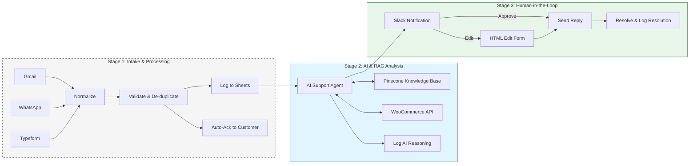
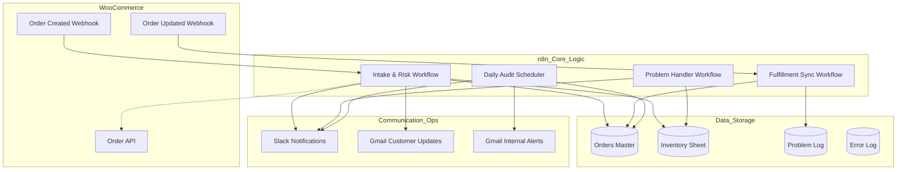
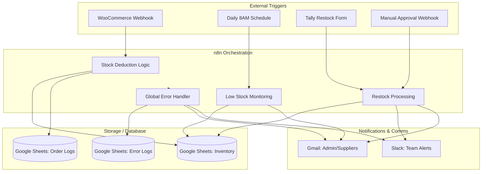
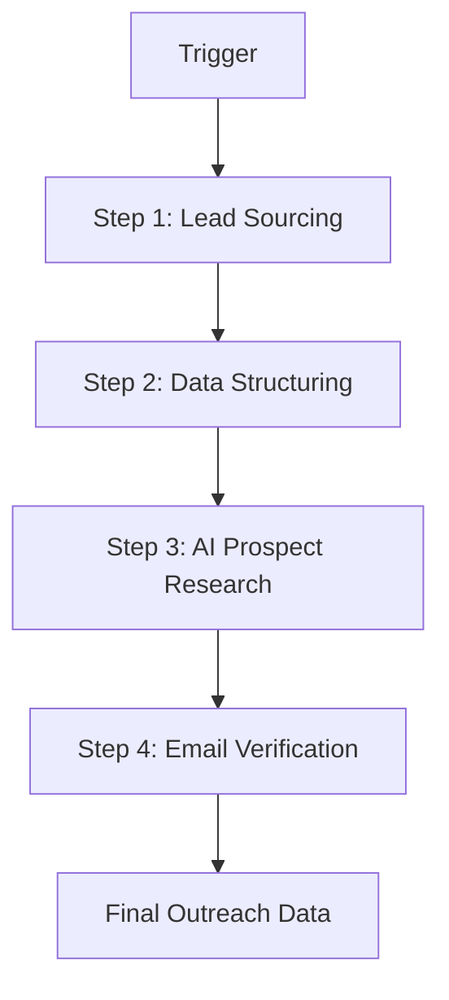
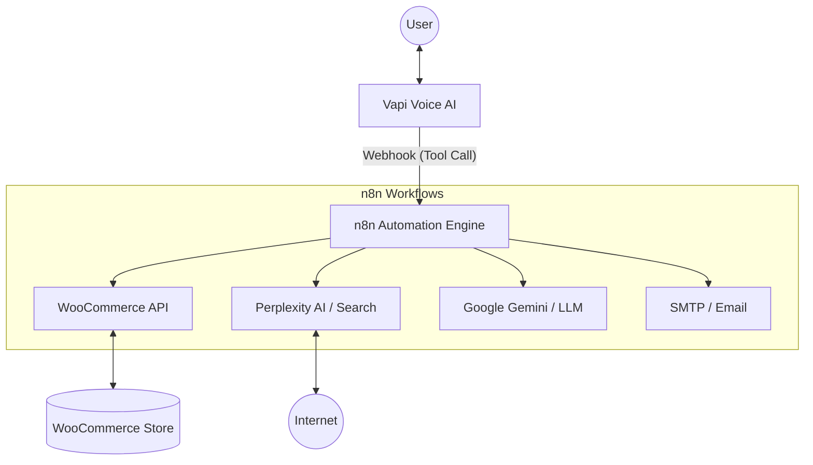
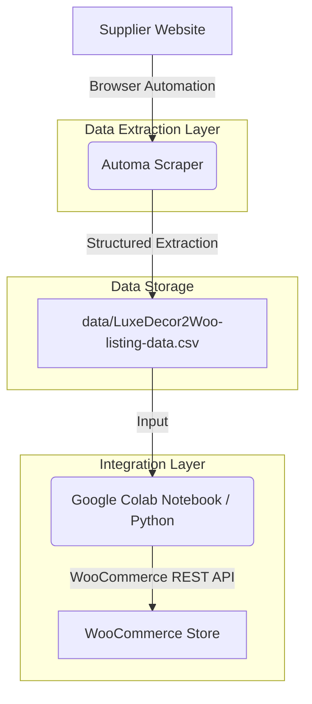

# Sonu Gupta

Automation Engineer | AI Workflows | RAG | n8n

I build automation systems that help businesses scale operations using AI, APIs, and workflow automation.

## Core Skills

• Workflow Automation (n8n)\
• LLM Integrations\
• RAG (Retrieval Augmented Generation)\
• Rest API\
• Web Scraping & Data Pipelines\
• Lead Generation & Email Marketing System\
• Error Handling, Human-in-the-Loop (HITL), Secure & Governed AI Agentic Systems

## Featured Projects

### AI-Human Hybrid Customer Support Management
Production-ready n8n workflow that manages customer support tickets from multiple channels (Gmail, WhatsApp, Typeform, Tally, and custom webhooks). It leverages AI (Google Gemini) with Retrieval-Augmented Generation (RAG) to classify issues, check order statuses in WooCommerce, and draft professional responses for human review [AI-Human Hybrid Customer Support Management](https://github.com/sah-automation/customer-support-ticket-management)

### WooCommerce Order Management & Automation
A robust, enterprise-grade order management and automation system built with n8n. This project bridges the gap between a WooCommerce storefront and back-office operations, providing automated fraud detection, inventory recovery, Slack-based interactive reviews, and detailed operational auditing [WooCommerce Order Management & Automation](https://github.com/sah-automation/woocommerce-order-management)

### WooCommerce Inventory Management Automation
An end-to-end automation solution built with n8n to streamline inventory management between WooCommerce and Google Sheets. [WooCommerce Inventory Management Automation](https://github.com/sah-automation/woocommerce-inventory-management-automation)

### Email Marketing Automation
N8N workflows designed to automate a multi-step cold email outreach campaign. It uses Google Sheets as a central tracking system and Gmail for deliverability.
[Email Outreach Automation with n8n](https://github.com/sah-automation/email-marketing-automation-n8n)

### Google Maps Lead Generation Automation
An automated, end-to-end lead generation pipeline built on n8n. It intelligently sources business leads from Google Maps, conducts deep prospect research using Google Gemini, and verifies email deliverability via the Reoon API.
[AI-Powered Lead Generation Engine](https://github.com/sah-automation/b2b-lead-generation)

### Ecommerce AI Voice Assistant
An advanced AI-powered voice assistant designed for ecommerce store. This system leverages Vapi for high-fidelity voice interactions and n8n for robust backend automation, integrating directly with WooCommerce and multiple AI models.
[Ecommerce AI Voice Assistant](https://github.com/sah-automation/ecommerce-AI-voice-assistant)

### AI Wordpress Blog Automation
An advanced n8n workflow that automates the entire content lifecycle: from SEO-driven research and planning to professional writing, styled HTML formatting, and WordPress publishing.
[WordPress Auto-Blogging with n8n](https://github.com/sah-automation/wordpress-auto-blogger)

### Woocommerce Product Automation System
Large scale automation system that scrapes supplier product data, optimizes with AI, and publishes to WooCommerce using REST API. This system streamlines the process of extracting complex product details, including variations, attributes, and high-quality images.
[Woocommerce Product Lister](https://github.com/sah-automation/woocommerce-product-lister)

## Tech Stack

Python\
n8n\
REST APIs\
RAG\
Web Scraping\
AI APIs\
WordPress / WooCommerce

## Open to

Automation Engineer roles\
AI Automation Specialist roles\
Workflow Automation roles

## Workflow Overview

