# Sonu Gupta

Automation Engineer | AI Workflows | Python | n8n

I build automation systems that help businesses scale operations using AI, APIs, and workflow automation.

## Core Skills

• Workflow Automation (n8n)\
• Python Automation Scripts\
• AI API Integrations\
• Web Scraping & Data Pipelines\
• Ecommerce Automation\
• Lead Generation Systems

## Featured Projects

### Email Marketing Automation
N8N workflows designed to automate a multi-step cold email outreach campaign. It uses Google Sheets as a central tracking system and Gmail for deliverability.
[Email Outreach Automation with n8n](https://github.com/sah-automation/email-marketing-automation-n8n)

### AI Wordpress Blog Automation

An advanced n8n workflow that automates the entire content lifecycle: from SEO-driven research and planning to professional writing, styled HTML formatting, and WordPress publishing.
[WordPress Auto-Blogging with n8n](https://github.com/sah-automation/wordpress-auto-blogger)

### Woocommerce Product Automation System

Large scale automation system that scrapes supplier product data, optimizes with AI, and publishes to WooCommerce using REST API. This system streamlines the process of extracting complex product details, including variations, attributes, and high-quality images.
[Woocommerce Product Lister](https://github.com/sah-automation/woocommerce-product-lister)
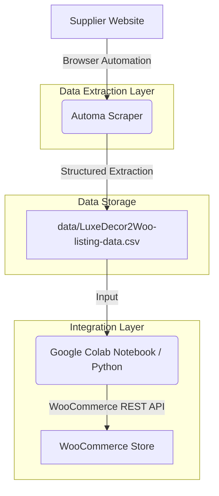

### Google Maps Lead Generation Automation

An automated, end-to-end lead generation pipeline built on n8n. It intelligently sources business leads from Google Maps, conducts deep prospect research using Google Gemini, and verifies email deliverability via the Reoon API.
[AI-Powered Lead Generation Engine](https://github.com/sah-automation/b2b-lead-generation)
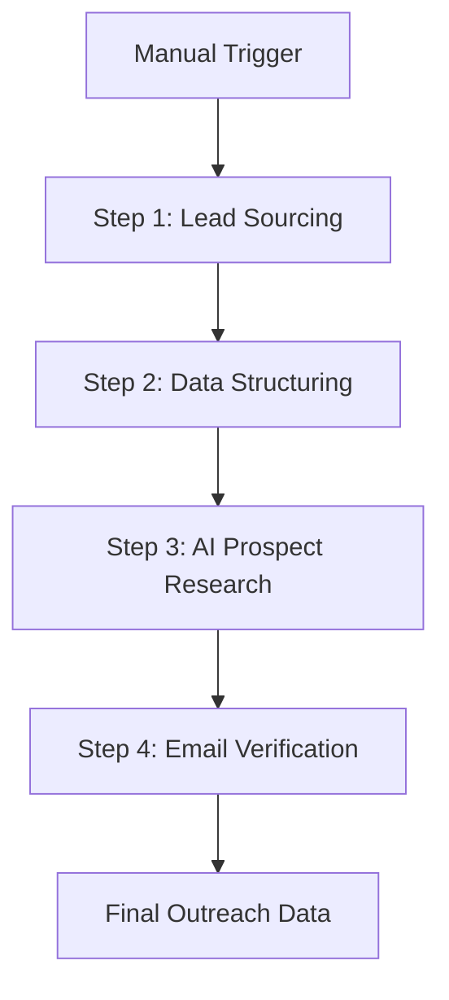

### Ecommerce AI Voice Assistant

An advanced AI-powered voice assistant designed for ecommerce store. This system leverages Vapi for high-fidelity voice interactions and n8n for robust backend automation, integrating directly with WooCommerce and multiple AI models.
[Ecommerce AI Voice Assistant](https://github.com/sah-automation/ecommerce-AI-voice-assistant)
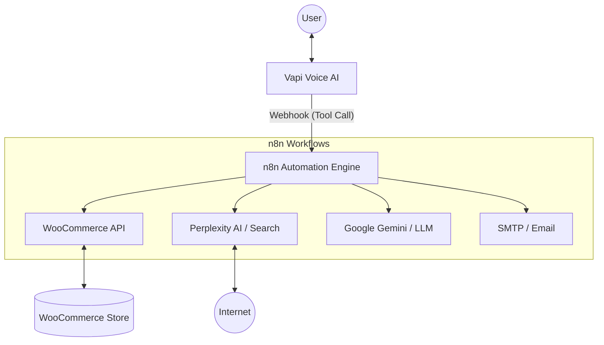

## Tech Stack

Python\
n8n\
REST APIs\
Web Scraping\
AI APIs\
WordPress / WooCommerce

## Open to

Automation Engineer roles\
AI Automation Specialist roles\
Workflow Automation roles

## Workflow Overview

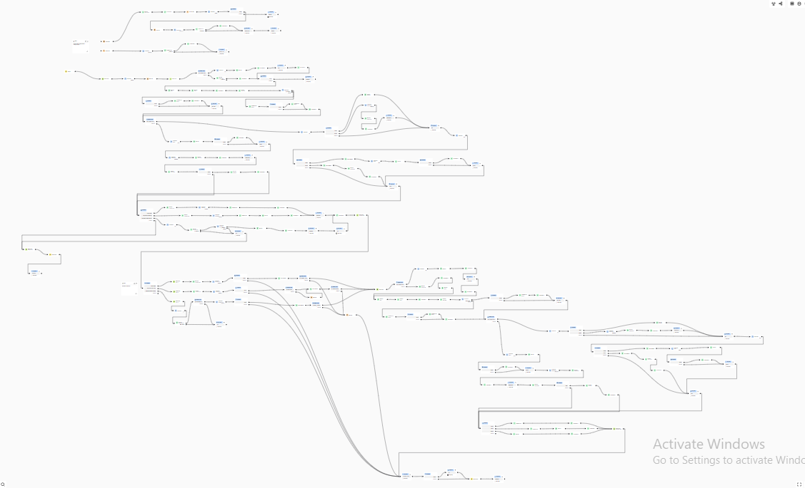
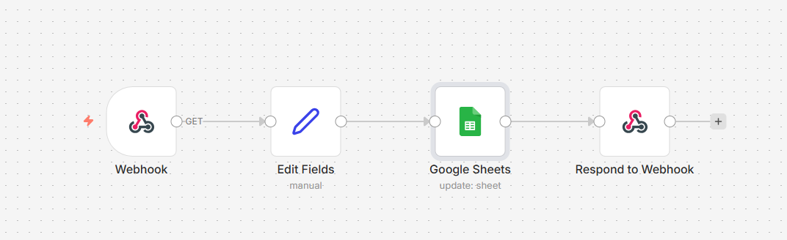
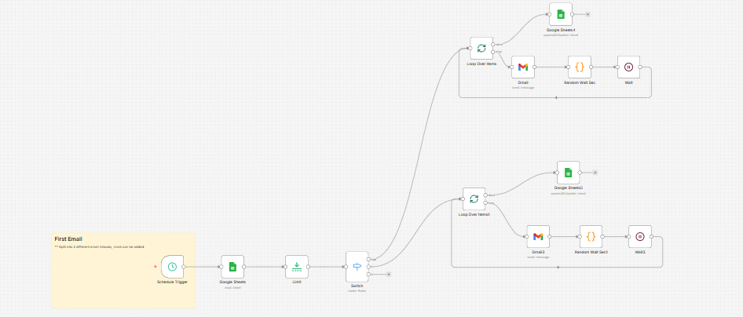
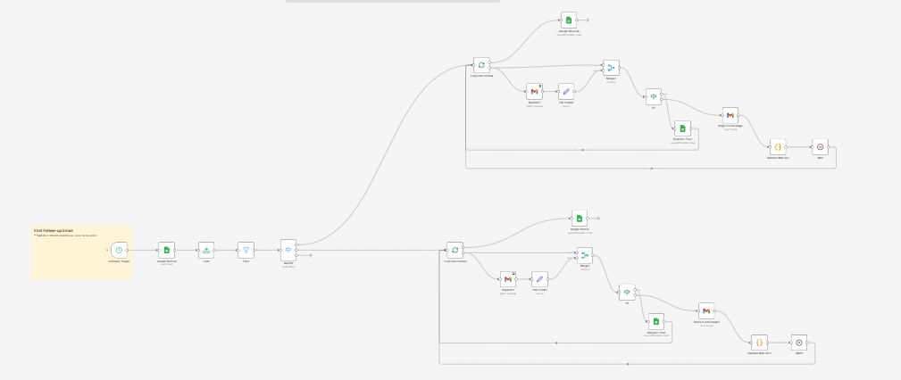
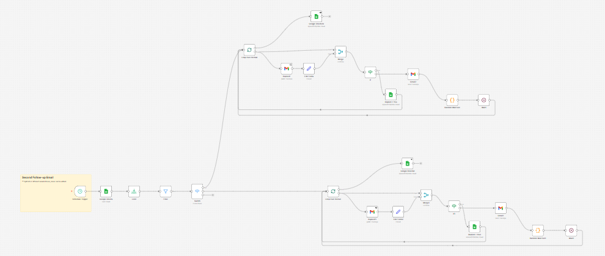
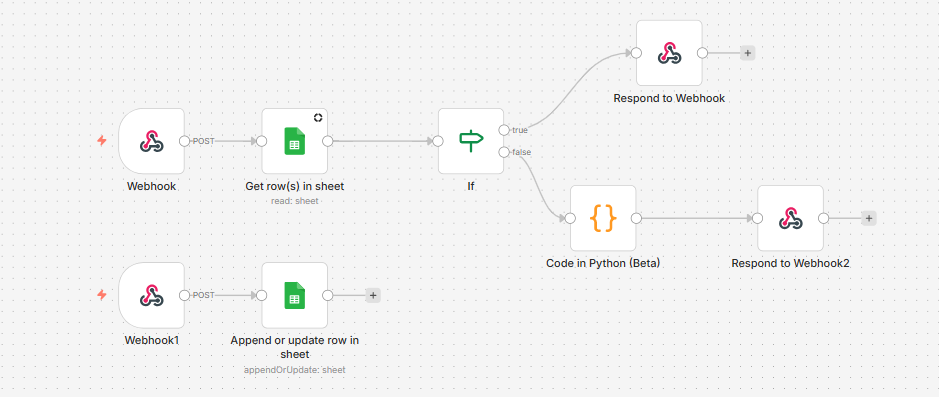
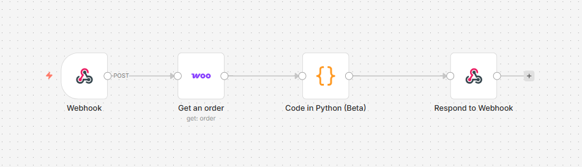
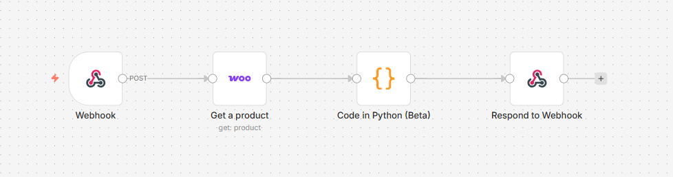

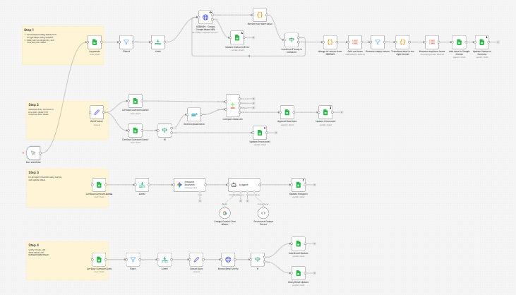
